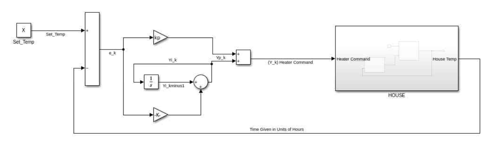
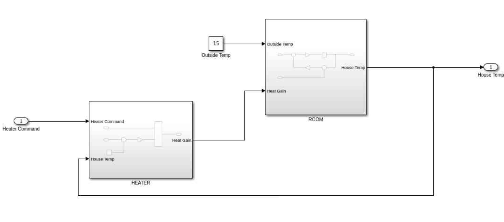
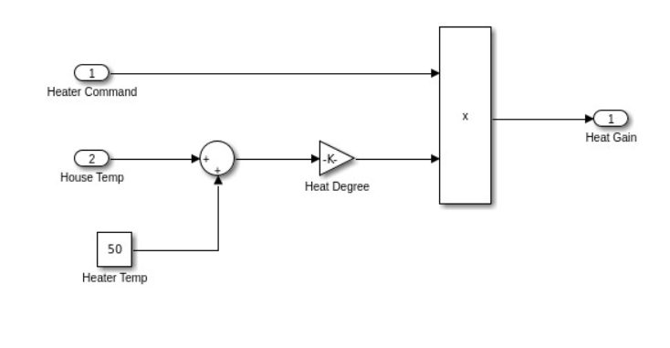
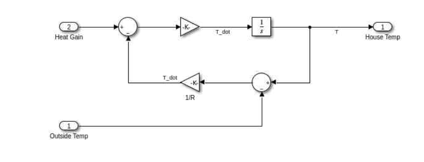

# 🔥 Thermostat PI Controller – MATLAB Simulink Project

A Simulink-based simulation of a **thermostat system** using a **Proportional-Integral (PI) Controller** to regulate indoor temperature. This project models heat gain from a heater and temperature dynamics of a room, integrating control theory with thermal system simulation.

---

## 🧠 Project Overview

This model demonstrates how a thermostat responds to a temperature setpoint using a PI control strategy. The system includes:

- **PI control loop** with proportional and integral compensation
- **Heater subsystem** simulating thermal gain
- **Room subsystem** simulating heat loss and ambient conditions
- Adjustable parameters such as outside temp and heater capacity

The simulation visualizes how the **house temperature** is regulated over time.

---

## ⚙️ System Components

### 🎯 PI Controller

Computes the control signal based on the **temperature error** using both proportional and integral terms.

---

### 🌡️ House Thermal Dynamics

Integrates the net thermal change to output the house temperature.

---

### 🔥 Heater Subsystem

Calculates heat gain based on heater command and difference between **heater temp** and **house temp**.

---

### 🏠 Room Subsystem

Simulates the thermal behavior of the house, modeling both heat gain and **heat loss to the environment**.

---

## 📦 File Structure

| File                          | Description                             |
|-------------------------------|-----------------------------------------|
| `thermostat_model.slx`        | Main Simulink model                     |
| `PI_Controller_Model.png`     | PI controller logic diagram             |
| `Heater_Subsytem_Model.png`   | Heater dynamics                         |
| `Room_Subsytem_Model.png`     | Room model showing heat gain/loss       |
| `House_Subsytem_Model.png`    | Full house temperature calculation logic|

---

## 🔧 Requirements

- MATLAB R2025a
- Simulink
- Basic understanding of feedback control systems

---

## 💡 Applications

- HVAC and smart home automation
- Real-time temperature control simulation
- Control systems education
- Embedded systems prototyping

---

## 🧑‍💻 Author

**Akshat Gupta**  
🔗 [LinkedIn](www.linkedin.com/in/akshat-gupta-9b649a378)   

---

